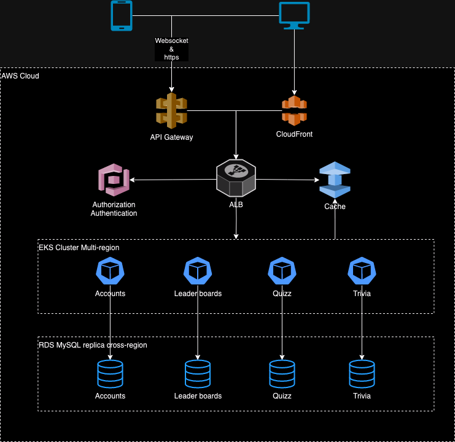

# 🧬 Architecture overview

## 🏛️ Structure

### 1. 🎯 Problem Statement and Context

Many people from everywhere are going to join in this online chat game, the challenge is to keep the system available for 24/7 with no downtime.
The user cannot feel any impact of having software updates, actually the user would never know when a new version was released.
People will be sending and reciving messages all the time from anyone to anyone, the system must be fast, with very low latency.

### 2. 🎯 Goals

1. Very low latency! Messages from user to other user should be delivered in ~1s.
2. Close to zero downtime, the system should be resilient and have disaster recovery mecanism.
3. The system should be able to scale easily due the nature of the problem.
4. Solution should follow cloud-native principles like Container-based, API-based, Independently scalable, Reliable and Portable.
5. Observability is mandatory, be able to see software behavior, collect metrics, create insights, etc.
6. Built-in solid principles, like isolation, independent, soa and soc.
7. Embbeded quality with flavors of tests: unit test, contract test, integration test, stress test and chaos test.

### 3. 🎯 Non-Goals

1. Realtime message delivery.
2. Monolithic solution.
3. Mobile-native technology is not allowed, we want one app for IOS and other app for Android.
4. Lombok library is forbidden.
5. Custom shared libraries are forbidden.
6. Clean code principles are forbidden.

### 📐 4. Principles

1. Customer centric.
2. Use composition over heritance. Try to decouple componentes as much as we can.
3. Observability first, expose metrics and logs to enable tracking and monitor anything.
4. Use idempotency to prevent duplications and improve distributed integrity.
5. Think on async calls when design the features.
6. Use smaller API contracts as much as we can, and versioning is a requirement.

## 🏗️ 5. Overall Diagrams

### 🗂️ 5.1 Overall architecture

### 🗂️ 5.2 Deployment

### 🗂️ 5.3 Use Cases 

#### Sending message

## 🧭 6. Trade-offs

List the tradeoffs analysis, comparing pros and cons for each major decision.
Before you need list all your major decisions, them run tradeoffs on than.
example:

### Major Decisions: 
1. Build native mobile app for Android and iOS instead of using cross-platform app.
2. We're using multi region EKS cluster in order to reduce latency all over the world.
3. We're using RDS replica cross-region in order to reduce latency all over the world.
4. Choose managed Elastic Cache instead of redis cluster.

### Tradeoffs:
1. Native mobile vs Cross-platform
    - PROS (+) 
      * Native Apps Have the Best Performance.
      * Native Apps Have Lower Risks of Bugs.
      * Native Apps Receive Fast Updates.
    - CONS (-)
        * Higher Costs Involved With Native Apps
2. EKS vs ECS
   - PROS (+)
     * Reduce latency over the world due multiple availability zones.
   - CONS (-)
     * Operational overhead due responsible for maintaining and operating the worker nodes in your cluster.
3. Cross-region replica vs Single region
   - PROS (+)
     * Minimize latency by maintaining object copies in AWS Regions that are geographically closer to the users.
   - CONS (-)
     * Could have replication lag.
4. Elastic Cache vs Redis
   - PROS (+)
     * Minimize operational overhead due fully managed service for Redis.
   - CONS (-)
     * Higher costs involved with elastic cache

### 🌏 7. For each key major component

[//]: # (What is a majore component? A service, a lambda, a important ui, a generalized approach for all uis, a generazid approach for computing a workload, etc...)
[//]: # (Exemplos of other components: Batch jobs, Events, 3rd Party Integrations, Streaming, ML Models, ChatBots, etc...)
[//]: # (Recommended Reading: http://diego-pacheco.blogspot.com/2018/05/internal-system-design-forgotten.html)

#### 7.1 Send message service
Service responsible to send messages from one user to another.

##### Class diagram

[//]: # (classic uml diagram with attributes and methods)

##### Contract documentation

[//]: # (Operations, Inputs and Outputs)

##### Persistence model

[//]: # (Diagrams, Table structure, partiotioning, main queries.)

##### Algorithms/Data Structures

[//]: # (Spesific algos that need to be used, along size with spesific data structures.)

### 🖹 8. Migrations

IF Migrations are required describe the migrations strategy with proper diagrams, text and tradeoffs.

### 🖹 9. Testing strategy

Explain the techniques, principles, types of tests and will be performaned, and spesific details how to mock data, stress test it, spesific chaos goals and assumptions.

### 🖹 10. Observability strategy

Explain the techniques, principles,types of observability that will be used, key metrics, what would be logged and how to design proper dashboards and alerts.

### 🖹 11. Data Store Designs

For each different kind of data store i.e (Postgres, Memcached, Elasticache, S3, Neo4J etc...) describe the schemas, what would be stored there and why, main queries, expectations on performance. Diagrams are welcome but you really need some dictionaries.

### 🖹 12. Technology Stack

Describe your stack, what databases would be used, what servers, what kind of components, mobile/ui approach, general architecture components, frameworks and libs to be used or not be used and why.

### 🖹 13. References

* Architecture Anti-Patterns: https://architecture-antipatterns.tech/
* EIP https://www.enterpriseintegrationpatterns.com/
* SOA Patterns https://patterns.arcitura.com/soa-patterns
* API Patterns https://microservice-api-patterns.org/
* Anti-Patterns https://sourcemaking.com/antipatterns/software-development-antipatterns
* Refactoring Patterns https://sourcemaking.com/refactoring/refactorings
* Database Refactoring Patterns https://databaserefactoring.com/
* Data Modelling Redis https://redis.com/blog/nosql-data-modeling/
* Cloud Patterns https://docs.aws.amazon.com/prescriptive-guidance/latest/cloud-design-patterns/introduction.html
* 12 Factors App https://12factor.net/
* Relational DB Patterns https://www.geeksforgeeks.org/design-patterns-for-relational-databases/
* Rendering Patterns https://www.patterns.dev/vanilla/rendering-patterns/
* REST API Design https://blog.stoplight.io/api-design-patterns-for-rest-web-services

